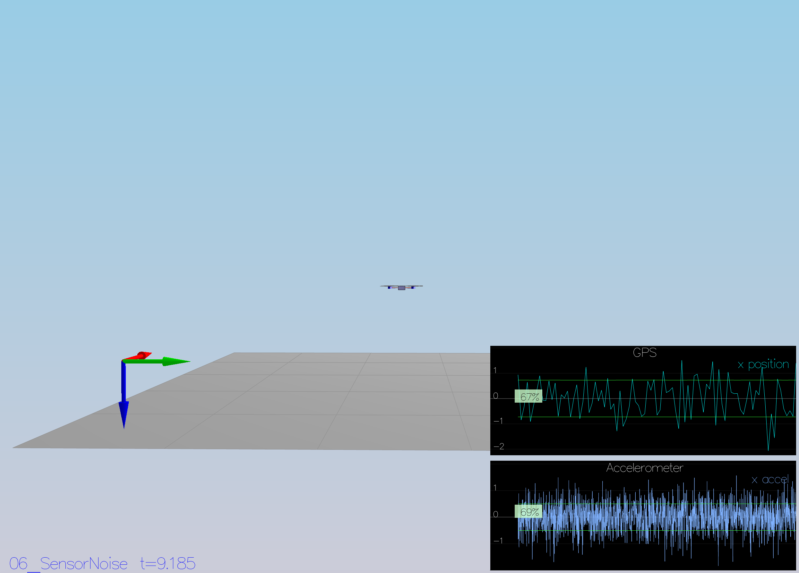
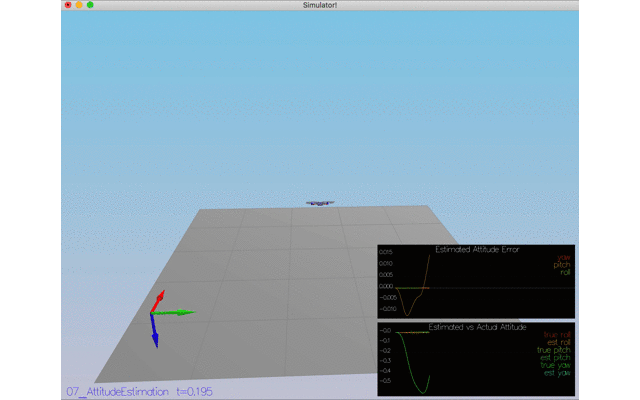
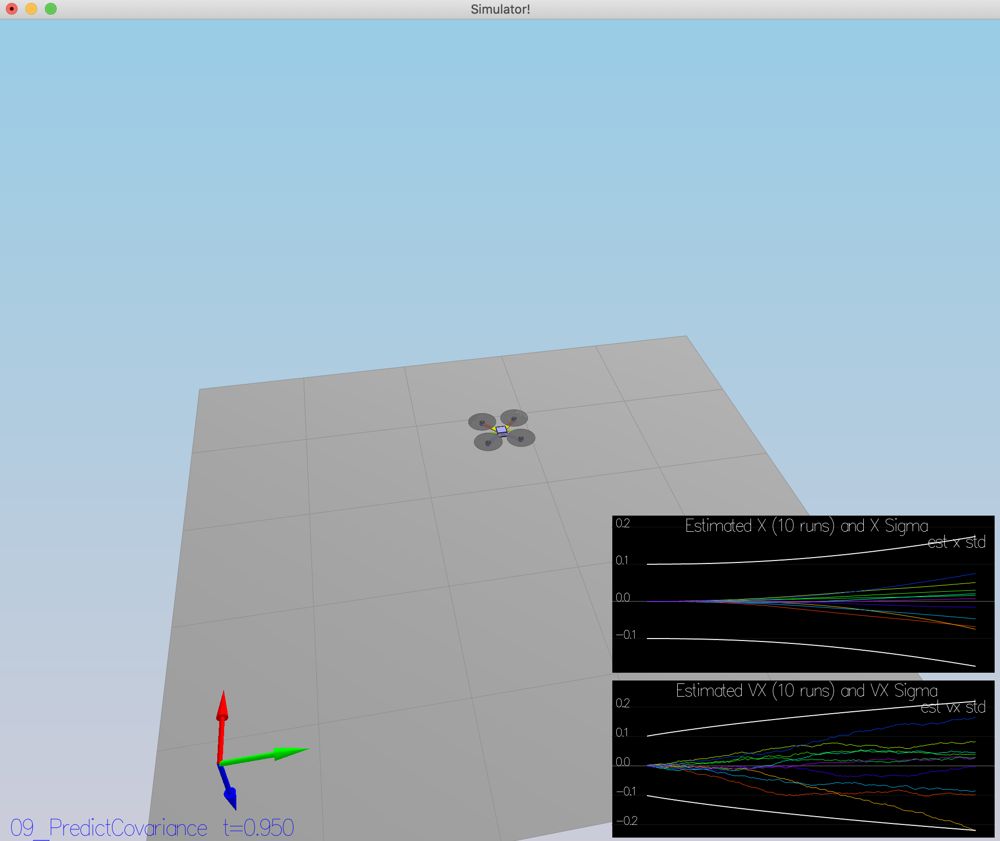
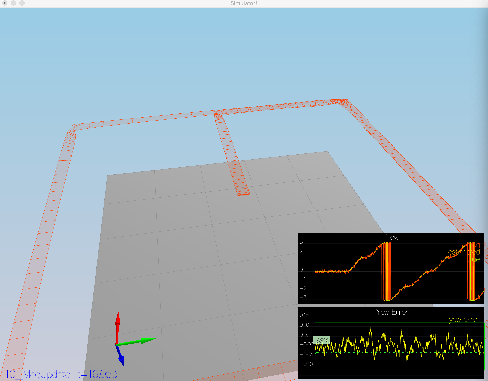
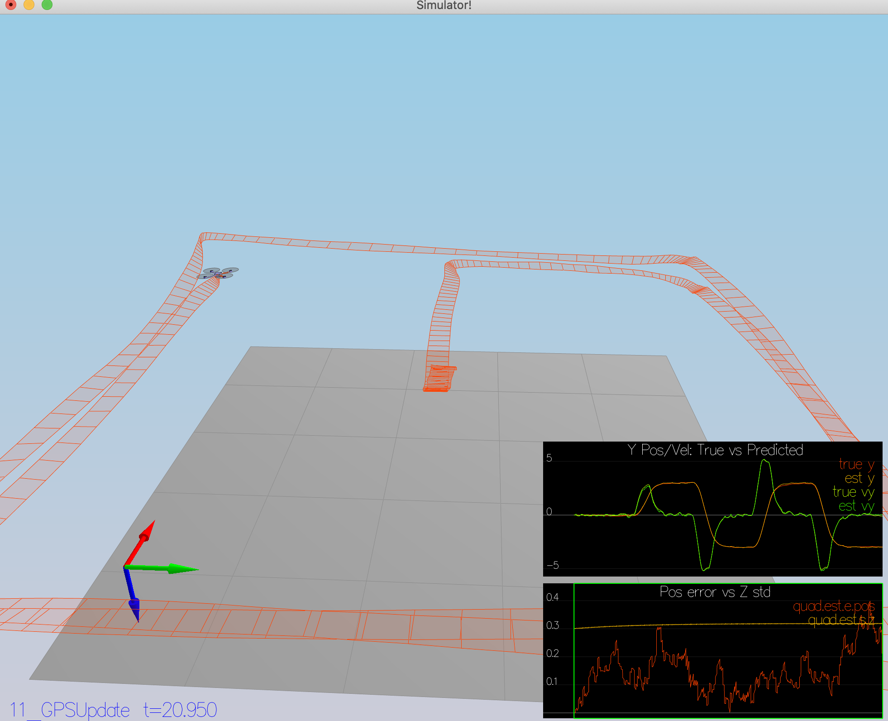
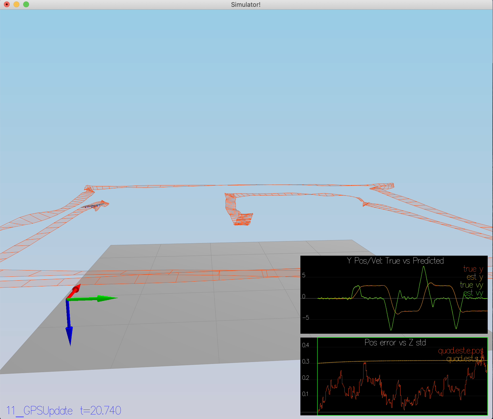

# FCND project 4: Estimation
Each rubric item and steps taken to address them during the course of the project is summarized here.

## Determine the standard deviation of the measurement noise of both GPS X data and Accelerometer X data.
Simulated sensor data for GPS position X and acceleration measurement from IMU is written to files `Graph1.txt` and `Graph2.txt`. Wrote a helper python script `process_logs.py` (included in the submission) to parse these two log files and compute standard deviation of observations using numpy.std() call. `compute_std_gps_sensor` prints standard deviation of gps data and `compute_std_imu_sensor` prints out standard deviation of IMU sensor data. 

One observation was that we need to capture the standard deviation when we have maximum samples collected from the simulation run -- if the simulation is actively running, the computed standard deviation was not representative of the sensor data. Here is the screen shot of completed scenario 6.

## Implement a better rate gyro attitude integration scheme in the UpdateFromIMU() function.
In this step, the complementary filter-type attitude filter was replaced by a more accurate implementation.

I took the `Quaternion` route instead of using the rotation matrix route for this implementation. First, I instantiated a `Quaternion` using the estimated roll, pitch, and yaw. Later, I was able to integrate the gyro measurements using `IntegrateBodyRate` method of `Quaternion` over time of measurement to get the updated roll, pitch, and yaw. I ensured that I commented out the older implementation.

## Implement all of the elements of the prediction step for the estimator.

In this step, first `PredictState()` is implemented using current state and acceleration and gyro measurements. We instantiate a `Quaternion` using estimated roll, pitch, and yaw. This body frame attitude is converted to inertial frame using `Rotate_BtoI` so that we can use these inertial frame observations to update the state. We retain Yaw as-is in this update. Here is the outcome after implementing the prediction step. As you can see the the estimator is able to track the state reasonably with drifting away over longer times.

Next, `GetRbgPrime()` method is implemented which involves careful population of a 3 by 3 matrix with multiple cosine and sine of roll, pitch, and yaw angles.

Finally, the `Predict()` method is implemented which invokes the above methods. We populate `gPrime` with appropriate entries in this method and apply the EKF covariance update.

After introducing realistic IMU sensor, we tune the prediction covariance for position and velocity by refining `QPosXYStd` and `QVelXYStd`. After iterative refinement of prediction covariance to match the ideal plot, here is the outcome. 

## Implement the magnetometer update.
In this step, `UpdateFromMag()` method is implemented for accurate yaw update. Required matrices were already initialized with default values. I had to update `hPrime` and `zFromX` matrices for proper update of yaw estimate. Had to ensure that the difference between measured and estimated yaw is properly checked for direction of angle using range checks and adjust them if out of bounds. After complete implementation of this method, here is the outcome.

## Implement the GPS update.
In this step, we move from using ideal estimator and an ideal IMU to using the estimator that was implemented in the previous steps and using realistic IMU measurements. 

`UpdateFromGPS()` method implemented in this step with proper initialization of `hPrime` and `zFromX`. `zFromX` is updated using estimated state information and finally used for GPS update. Here is the outcome of implementing GPS update and using a realistic IMU measurements.

# Flight Evaluation

## Meet the performance criteria of each step.
To ensure the provided estimator and controller works for all the scenarios, I re-ran all the scenario tests. Most of the scenarios worked fine except for Magnetometer Update (10_MagUpdate) which was working fine before. I had to tune `QYawStd` by increasing it slightly resulting in successful completion of this scenario. After changing `QYawStd`, I re-checked all the scenarios and now all of them PASS.

## De-tune your controller to successfully fly the final desired box trajectory with your estimator and realistic sensors.
After placing my own implementation of the controller from the previous project `QuadControl.cpp` and the accompanying controller parameters in `QuadControlParams.txt`, I had to do no other changes to the parameters of the controller. All the scenarios passed with my prior setting of controller parameters. Here is the outcome from the simulator.

 
